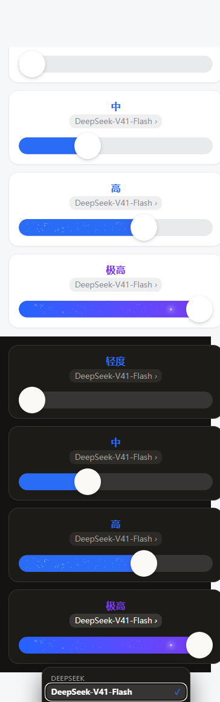
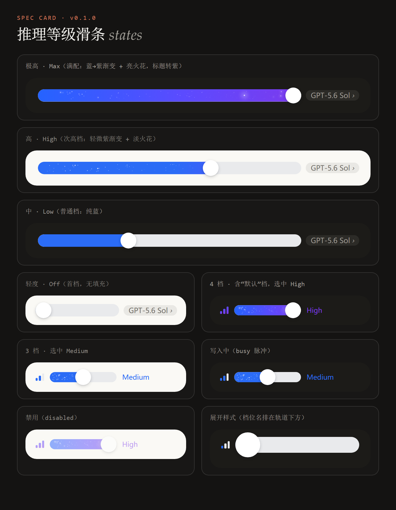
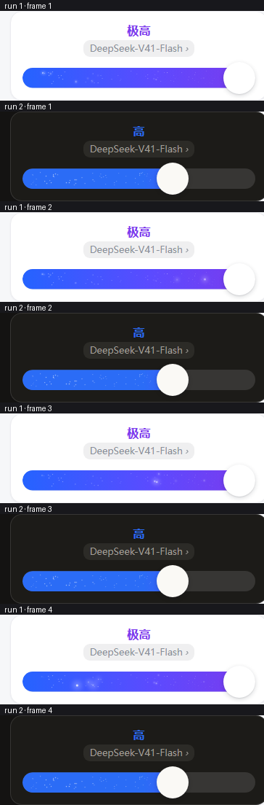

# 推理等级滑条 · dsh-client-ui-reasoning-slider

把作曲栏里「打开模型菜单 → 进「推理等级」子面板 → 选一行」的操作，换成一条 **Codex 式的分段滑轨**：拖动、点按、方向键都能换档，松手即提交。



<sub>上图是组件在 321px 宽度下的真实渲染（浅色 4 张 + 深色 4 张，最后一张展开了模型菜单），不是设计稿。</sub>

---

## English summary

A Codex-style reasoning-effort slider for the DeepSeek Harness composer. It is a
dependency-free custom element (`<dsh-reasoning-slider>`, Shadow DOM) plus a thin
React seat that mounts it into the composer's model slot, shadowing the shipped
model chip at `priority: -1` and falling back to the trailing list slot when a
future build refuses the shadow. Effort levels come from the same
`modelDirectories` store the official menu uses, so switching either way stays in
sync; the control also carries its own model picker. The fill is a solid tier
colour, and the top two tiers add a violet gradient with a sparkle field that
sweeps left → right into the thumb. No build step is required to consume it:
`lib/client.js` is a `window.__ModuleLoader__.load({ id, factory })` bundle.

```powershell
dsh plugin --profile desktop add link:"<path to this repo>"   # then restart the app
```

---

## 特性

- **一条滑轨换档**：拖动（指针捕获，松手吸附最近档位）、点按任意位置、键盘 `←/→/↑/↓/Home/End/PageUp/PageDown/1-9`。
- **接管作曲栏那一格**：以 `priority: -1` 顶替官方模型芯片（契约允许的 shadow 方式），顶替失败自动降级为"并排"而不会消失。
- **模型切换不丢**：滑条自带模型菜单（点模型名那一行打开），走同一个 `directory.select`，并按新模型自己的默认档位提交。
- **框架无关的组件**：自定义元素 + Shadow DOM，零依赖；React 只负责把它塞进槽位。脱离 DSH 也能单独用。
- **跟随主题**：只读 `--dsw-*` 设计变量，自动跟随皮肤与亮暗模式（`:host-context([data-ds-dark-theme])`），也可用 `dark` 属性强制。
- **四档语义**：`Off / Low / High / Max` → **轻度 / 中 / 高 / 极高**；普通档纯蓝填充，次高档渐入紫 + 细密火星，最高档满配渐变 + 火星扫掠、标题转紫。
- **可诊断**：座位元素常驻 `data-session / data-available / data-groups / data-levels / data-problem`，空白控件不再是无头案。

| 极高（最高档） | 扫掠方向（四帧胶片） |
| --- | --- |
|  |  |

---

## 安装

三种方式任选，装完**重启一次客户端**（客户端插件在启动时装载）：

```powershell
# 1) 本地目录（开发用，改完 node build.mjs + 刷新页面即生效，不必重装）
dsh plugin --profile desktop add link:"D:\path\to\reasoning-slider"

# 2) 直接从 GitHub 装
dsh plugin --profile desktop add github:NuoAug/dsh-client-ui-reasoning-slider

# 3) 从 npm 装（发布后）
dsh plugin --profile desktop add dsh-client-ui-reasoning-slider
```

卸载：

```powershell
dsh plugin --profile desktop remove dsh-client-ui-reasoning-slider
```

---

## 它怎么接上官方模型选择（关键接口）

官方模型菜单在 `@deepseek-ai/dsh-client-ui-model-selection` 里，对外提供客户端服务 **`modelDirectories`**：

```js
const directory = modelDirectories.directoryFor(sessionId);

directory.store.getSnapshot()
// {
//   current : { provider, model, reasoningEffort? } | null
//   groups  : [{ id, models: [{ id, name, reasoning?: {
//                  defaultEffort?,                       // 有默认档时官方不显示“默认”这一项
//                  efforts: [{ id, name, description? }] // 档位顺序即滑轨顺序
//              } }] }]
//   pending : 正在提交的选择 | null     → 滑条 busy 脉冲
//   error   : 最近一次失败信息 | null   → 右侧红点 + title
// }

await directory.select({ provider, model, reasoningEffort });  // 省略 reasoningEffort = 供应商默认
```

`src/seat.js` 把 `levels` / `value` / `busy` / `models` 同步给组件，并把组件的
`reasoning-change`（换档）与 `reasoning-model-change`（换模型）翻译成上面这次 `select` 调用。

**槽位接管**：`conversation.input.model` 的契约允许按 priority 顶替现有占用者
（*"register at a different priority to shadow it (lowest renders)"*，并标注
`replaceRisk: "shadows-shipped-ui"`）。官方 `ModelSelect` 用默认 priority，本插件以 **-1** 注册同一槽位。
顶替被拒时自动降级到 `conversation.input.right`（list 槽，可与官方控件共存）。
开关在 `src/seat.js` 的 `SEAT_MODE`（`"replace"` / `"beside"`）。

> 这个接管**已在真实实例里验证**：官方芯片消失、本滑条出现、目录数据（2 个 provider × 2 个模型）与四档档位都正常读回。

---

## 组件 API（脱离 DSH 也能用）

```html
<dsh-reasoning-slider id="rs" compact label="推理等级"></dsh-reasoning-slider>
<script type="module">
  import "./src/reasoning-slider.js";
  const rs = document.getElementById("rs");
  rs.levels = [
    { id: "", label: "默认", note: "由供应商自定" },
    { id: "low", label: "中", note: "轻量推理" },
    { id: "high", label: "高", note: "深推理" },
    { id: "max", label: "极高", note: "最高档" },
  ];
  rs.value = "low";
  rs.addEventListener("reasoning-change", (event) => console.log(event.detail));
</script>
```

| 属性 / 特性 | 说明 |
| --- | --- |
| `levels`（属性传 JSON） | 档位数组，顺序即滑轨顺序；`id: ""` 表示“供应商默认”；某档写 `spark: true`（满配）或 `spark: "soft"`（轻微）可指定火花外观 |
| `value` | 当前档位 id |
| `models`（property） | 模型菜单数据：`[{ provider, providerLabel?, model, label?, current? }]`；点第二行打开菜单，选中发 `reasoning-model-change` |
| `card` / `headline` / `subtitle` / `chevron` | 卡片形态与居中标题块；`subtitle` 即模型名（属性与 property 均可赋值） |
| `rowlabel` / `stretch` | 轨道上方左对齐「高级 ›」行 / 轨道跟随容器宽度 |
| `busy` / `disabled` / `expanded` / `compact` | 写入中脉冲 / 禁用 / 档位名排在轨道下方 / 单行作曲栏形态 |
| `dark` | 强制深色主题（浅色与深色可同页并存） |
| `dots` | 显示档位圆点（**默认关闭**） |
| `variant="plain"` / `spark-tier="off"` | 回到细轨道纯色观感 / 关掉“按位置自动升级为火花档” |
| 事件 | `reasoning-change` → `{ id, label, index, level }`；`reasoning-model-change` → `{ provider, model }` |
| 方法 | `select(index, { silent })` |

**三档外观（按位置自动，可覆盖）**：设 `N` 为档位数

| 位置 | `data-tier` | 外观 |
| --- | --- | --- |
| 普通档 | —（无属性） | 纯蓝填充 `--rs-fill` |
| 次高档（`N ≥ 3` 时的倒数第二档） | `soft` | 填充靠近拇指处渐入紫 + **104 颗细火星**（0.5–1.3px，浅幅度轻闪，周期 ×2.4） |
| 最高档（最后一档） | `top` | 满配蓝→紫渐变 + **76 颗火星**（0.6–2.1px），强闪带自左向右扫向滑块，标题/数值转紫 |

**闪烁方向**：相位由 `#phaseSparks()` 按当前填充长度实时算起（`frac = x / pct` + ±5% 抖动），
所以闪光带**从已填充段最左端出发、向右推进，最后到达白色滑块**；拖动时相位跟着重算。

**几何与配色（改这几个变量就等于改比例）**：

| 变量 | 默认 | 说明 |
| --- | --- | --- |
| `--rs-track-height` / `--rs-thumb-size` | `28px` / `44px` | 胶囊高度 / 拇指直径（≈×1.57，两端与轨道齐平由 `--rs-pad = 拇指半径` 保证） |
| `--rs-track-width` | `240px` | 胶囊宽度（作曲栏用 118px） |
| `--rs-fill` | `#2b6cf6` | 普通档纯蓝填充 |
| `--rs-stop-1/2/3` | `#2563ff` / `#5b4bff` / `#7c3aed` | 最高档渐变三色 |
| `--rs-rail` | `#e9eaec` | 未填充轨道（深色主题自动取 `#ffffff1f`） |
| `--rs-dot` / `--rs-dot-on` / `--rs-dot-size` | `#c9ccd2` / `#ffffffb8` / `5px` | 档位圆点（仅在 `dots` 属性下生效） |
| `--rs-sweep` | `1.9s` | 火星扫掠周期；越小越激进 |

填充（连同渐变）铺满整条胶囊、由 `clip-path` 裁到拇指圆心，所以渐变不会被压缩。

**无障碍与动效**：宿主 `role="slider"` + `aria-valuemin/max/now/valuetext`，`busy` 时 `aria-busy`；
`prefers-reduced-motion` 下去掉位移与脉冲；刻意**不做滚轮换档**（避免在作曲栏误触）。

---

## 目录结构

```
reasoning-slider/
├─ src/
│  ├─ reasoning-slider.js     ← 组件本体（样式/拖拽/键盘/动画，框架无关）
│  ├─ seat.js                 ← DSH 挂载层（读 modelDirectories、写 select、占槽位）
│  └─ demo-harness.js         ← 演示页的数据与交互（假目录、busy/失败状态）
├─ lib/
│  ├─ client.js               ← 构建产物：DSH 客户端包（已提交，消费者无需构建）
│  └─ index.js                ← 宿主半区（本插件无宿主侧功能，仅让 profile 行可解析）
├─ demo/
│  ├─ template.html           ← 演示页模板（build.mjs 注入组件源码）
│  ├─ spec-template.html      ← 状态卡模板
│  ├─ compare-template.html   ← 四档对照模板（浅色/深色/模型菜单）
│  └─ *.png                   ← README 用的渲染截图
├─ tools/
│  ├─ check-bundle.mjs        ← 模拟 DSH 加载器校验产物（注册 id / 导出面）
│  ├─ check-inline.mjs        ← 校验生成页面的内联模块与 .js 产物语法
│  ├─ seat-smoke.mjs          ← 用 stub React + 假服务作用域跑一遍挂载层
│  ├─ probe-app.mjs           ← 用 CDP 驱动真实实例，读回 DOM/控制台/截图
│  ├─ sweep-strip.py          ← 多帧裁成胶片，用于核对扫掠方向
│  ├─ sweep-check.py          ← 逐列统计亮点，量化扫掠方向
│  └─ probes/                 ← 一次性排查脚本（槽位/命令面板的逆向记录）
├─ build.mjs                  ← 构建：src → lib/client.js + 三个演示页
├─ cordis.patch.yml           ← bundle 补丁：把本包作为一行插入 profile
└─ package.json
```

---

## 开发与验证

```powershell
node build.mjs                        # 构建（内含“产物必须能解析”的闸门）
node tools/check-bundle.mjs lib/client.js   # 加载器契约：只注册一次 + id 等于包名 + 导出面
node tools/check-inline.mjs lib/client.js demo.html demo/spec.html demo/compare.html
node tools/seat-smoke.mjs             # 挂载层冒烟（stub React + 假服务作用域）
start .\demo.html                     # 交互演示（内联模块，file:// 也能跑）
```

真实实例验证（需要本机已装 DSH）：

```powershell
dsh web --port 19399 --no-open        # 起一个隔离实例
node tools/probe-app.mjs "http://127.0.0.1:19399/?token=…" demo/app-live.png 20000
```

### 三个踩过的坑（都已在代码/构建里设防）

1. **客户端注册 id 必须等于包名，也等于 `cordis.patch.yml` 行里的 `name`**。不一致时加载器会
   把同一文件导入两次，报 `duplicate factory registration` 并**中止 web boot**。现在 id 由
   `package.json` 派生，且 `build.mjs` 会校验行名，不一致直接构建失败。
2. **座位组件里不能把"每次渲染都新建"的回调放进 effect 依赖**：那会让 `load()` 每次渲染都触发，
   最终以 React #185（maximum update depth exceeded）崩掉槽位。现在回调全部进 ref，订阅/加载按
   “每会话一次”，同步用签名字符串做依赖。
3. **消费 `modelDirectories` 必须一并声明 `remote` / `remote.session`**，否则服务代理会以
   `cannot get property "remote.session" without inject` 拒绝，表现为控件挂载成功但一片空白。

---

## 已知限制

1. **官方菜单里那一行不会被移除**：接管发生在作曲栏的槽位层，官方菜单本体打包在 `app.asar` 内，
   profile 插件改不动；两者状态完全一致（同一份 `directory.select`），不会打架。
2. 模型**没有声明推理等级**时自动退化为**只显示模型名 + 菜单**（`model-only`），那一格不会空着。
3. 子 agent 会话（`subagentAddress` 存在）不启用，与官方菜单行为一致。
4. 皮肤差异只影响观感：读的是皮肤定义的 `--dsw-*` 变量，缺省时用兜底色，不会白底白字。
5. 换档是**会话级**选择；「默认」档只在适配器没声明 `defaultEffort` 时出现。

---

## 许可

[MIT](LICENSE)。组件与视觉参考了 Codex 的推理强度控件，实现为独立重写，未包含其任何代码或素材。
