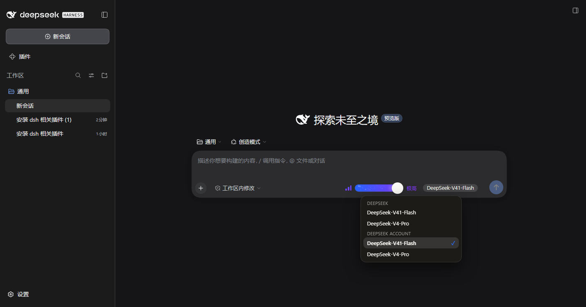
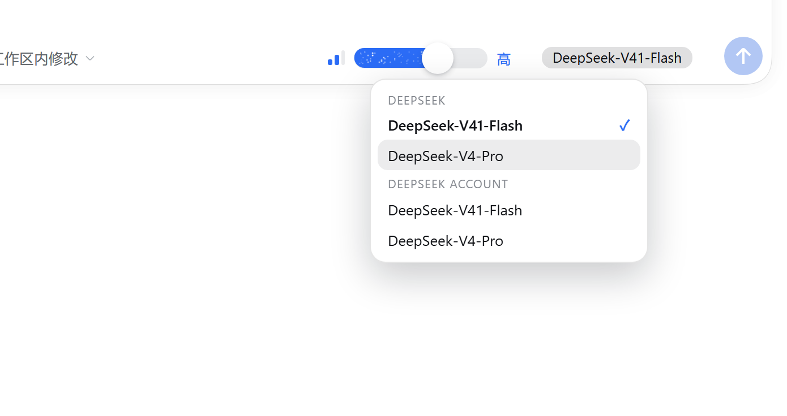
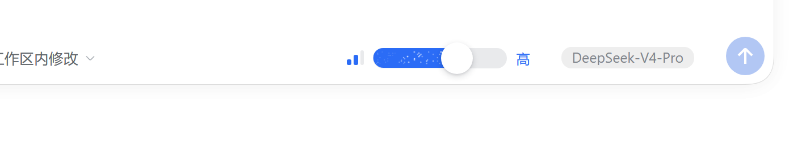
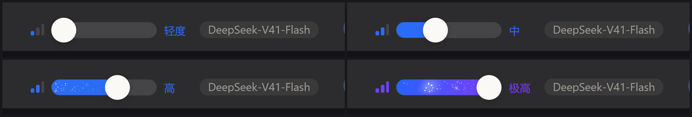
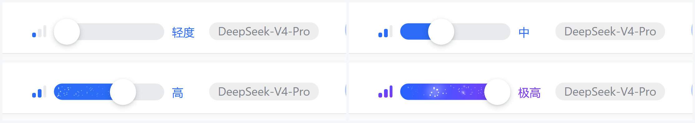
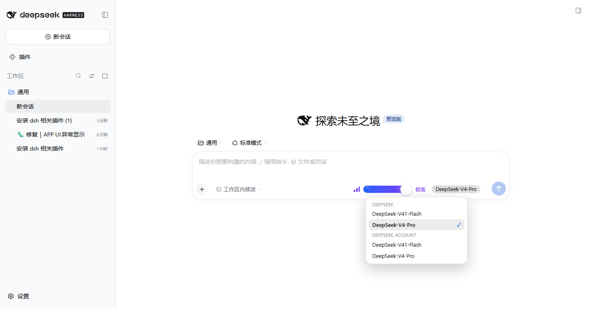

<div align="center">

# 推理等级滑条

**dsh-client-ui-reasoning-slider**

把作曲栏里「打开模型菜单 → 进「推理等级」子面板 → 选一行」三步操作，<br>
换成一条**可拖动、可点按、可键盘操作**的 Codex 式分段滑轨。

[](https://github.com/NuoAug/dsh-client-ui-reasoning-slider/releases)
[](LICENSE)
[](https://github.com/NuoAug/dsh-client-ui-reasoning-slider/actions/workflows/check.yml)
[](#安装步骤)

[项目介绍](#项目介绍) · [功能列表](#功能列表) · [安装步骤](#安装步骤) · [使用说明](#使用说明) · [截图](#截图) · [项目结构](#项目结构) · [开发与验证](#开发与验证) · [常见问题](#常见问题)

</div>



---

## 项目介绍

DeepSeek Harness（下称 DSH）作曲栏右下角那一格是「模型 + 推理强度」芯片。想调推理强度，得**打开模型菜单 → 找到「推理等级」子面板 → 点一行**；强度又是最常改的参数之一，这个路径每天要重复很多次。

本项目把这一格换成一条**滑轨**：

| | 官方芯片 | 本滑条 |
| --- | --- | --- |
| 改强度 | 三步（开菜单 → 子面板 → 选行） | **一步**：拖动 / 点按 / 方向键 |
| 看当前档 | 需展开菜单 | 轨道长度 + 电量表 + 档位名一眼可见 |
| 换模型 | 菜单里选 | 点滑条上的**模型行**直接选（同一个 `directory.select`） |
| 状态一致性 | — | 与官方菜单读写**同一份** store，两边永不打架 |

它由两部分组成：一个**零依赖的自定义元素**（组件本体，脱离 DSH 也能用），以及一层**很薄的 React 挂载胶水**（把组件塞进 DSH 槽位、把事件翻译成官方的模型选择调用）。

**谁适合用**

- 经常在「轻度 / 中 / 高 / 极高」之间来回切的用户；
- 想要更接近 Codex 那种视觉语言的自定义 UI；
- DSH 插件开发者：可直接读本项目作为「客户端插件 + 自定义元素 + 槽位接管」的参考实现。

---

## 功能列表

| 能力 | 说明 |
| --- | --- |
| 🎚 **一条滑轨换档** | 拖动（指针捕获，松手吸附最近档位）、点按轨道任意位置、悬停预览档位说明 |
| ⌨️ **完整键盘操作** | `←` `→` `↑` `↓` 换档，`Home` / `End` 首尾，`PageUp` / `PageDown` 翻档，`1`–`9` 直达；**刻意不做滚轮换档**（避免作曲栏误触） |
| 🧩 **接管作曲栏那一格** | 以 `priority: -1` 顶替官方模型芯片；顶替被拒时**自动降级**为并排显示，不会整个消失 |
| 🔁 **模型切换不丢** | 滑条自带模型菜单（点模型名那一行打开），按 provider 分组、当前项打勾，键盘可导航 |
| 🌗 **跟随主题** | 只读 `--dsw-*` 设计变量，自动跟随皮肤与亮暗；也可用 `dark` 属性强制 |
| ✨ **三档视觉** | 普通档纯蓝；次高档渐入紫 + 细密火星；最高档满配蓝→紫渐变 + 火星扫掠（自左向右），标题转紫 |
| 🃏 **两种形态** | 单行（作曲栏）与卡片（居中档位名 + 模型行 + 满宽轨道），同一组件切换属性即可 |
| ♿ **无障碍** | `role="slider"` + `aria-valuemin/max/now/valuetext`，`busy` 时 `aria-busy`；`prefers-reduced-motion` 下自动去掉位移与脉冲 |
| 🔍 **可诊断** | 座位元素常驻 `data-session / data-available / data-groups / data-levels / data-problem`，空白控件不再是无头案 |
| 🧪 **自带校验工具** | 加载器契约模拟、挂载层冒烟（stub React）、CDP 真机探针与自动截图脚本 |

---

## 安装步骤

### 前置条件

| 依赖 | 版本 | 说明 |
| --- | --- | --- |
| DeepSeek Harness | ≥ `0.2.0-rc.1` | 插件读取官方 `modelDirectories` 服务，需要该版本起的槽位契约 |
| Node.js | ≥ 20 | **只有改源码时才需要**；直接安装已构建好的 `lib/` 无需 Node |

### 方式一：从 GitHub 安装（推荐）

```powershell
dsh plugin --profile desktop add github:NuoAug/dsh-client-ui-reasoning-slider
```

### 方式二：本地目录（开发用）

```powershell
dsh plugin --profile desktop add link:"D:\path\to\reasoning-slider"
```

`link:` 会把目录链接进 profile，改完源码只需 `node build.mjs` + 刷新页面，**不必重装**。

### 方式三：下载发行版

到 [Releases](https://github.com/NuoAug/dsh-client-ui-reasoning-slider/releases) 下载 `dsh-client-ui-reasoning-slider-v0.1.0.zip`：解压后是自包含项目（含已构建产物与可直接双击的演示页），按方式二安装即可。

### 安装后必须重启客户端

客户端插件在**启动时**装载，装完请重启 DeepSeek Harness；之后作曲栏右下角那一格就会变成滑条。

### 验证是否生效

| 现象 | 含义 |
| --- | --- |
| 作曲栏出现「电量表 + 胶囊 + 白色滑块 + 档位名」 | ✅ 生效 |
| 旁边还留着官方「模型 + High」芯片 | ✅ 生效（影子接管被拒，走了并排降级；功能等价） |
| 该格完全空白 | ❌ 打开 DevTools 看座位元素的 `data-problem` 属性（会写明原因） |

### 卸载

```powershell
dsh plugin --profile desktop remove dsh-client-ui-reasoning-slider
```

---

## 使用说明

### 1. 换推理强度

三种方式任选，**松手即提交**（写入当前会话）：

```
拖动滑块 ──▶ 松手吸附到最近档位
点按轨道 ──▶ 直接跳到该档
键盘     ──▶ ← → ↑ ↓ / Home / End / PageUp / PageDown / 1-9
```

滑条右侧的**电量表**（三格）与**档位名**同步显示当前强度；悬停轨道会显示该档位的说明气泡。

### 2. 换模型

点滑条上的**模型行**（如 `DeepSeek-V41-Flash ›`）打开菜单：

- 按 provider 分组（`DEEPSEEK` / `DEEPSEEK ACCOUNT` …），当前模型加粗打勾；
- `↑` `↓` 移动高亮，`Enter` 选中，`Esc` 或点击外部关闭；
- 选中后走与官方菜单**完全相同**的 `directory.select`，并沿用新模型自己的默认档位。

| 菜单中选择 | 切换完成后 |
| --- | --- |
|  |  |

### 3. 档位与外观的对应关系

四档模型（`Off / Low / High / Max`）会被映射为：

| 档位 | 界面名 | 外观 |
| --- | --- | --- |
| 0（无填充） | **轻度** | 空轨道，滑块在最左 |
| 1 | **中** | 纯蓝填充 |
| 2（次高档） | **高** | 填充靠近滑块处渐入紫 + 细密火星轻闪 |
| 3（最高档） | **极高** | 满配蓝→紫渐变 + 火星扫掠（自左向右），标题转紫 |

> 自动规则：设 `N` 为档位数，**最后一档**取最高档外观、**倒数第二档**取次高档外观；也可用 `spark: true` / `spark: "soft"` 精确指定，或用 `spark-tier="off"` 关掉自动升级。

### 4. 在网页版 / 独立页面里使用

组件本身是标准自定义元素，不依赖 DSH：

```html
<dsh-reasoning-slider id="rs" compact label="推理等级"></dsh-reasoning-slider>
<script type="module">
  import "./src/reasoning-slider.js";
  const rs = document.getElementById("rs");
  rs.levels = [
    { id: "",    label: "默认", note: "由供应商自定" },
    { id: "low", label: "中",   note: "轻量推理" },
    { id: "high",label: "高",   note: "深推理" },
    { id: "max", label: "极高", note: "最高档" },
  ];
  rs.value = "low";
  rs.addEventListener("reasoning-change", (event) => console.log(event.detail));
</script>
```

### 5. 配置项速查

**元素属性 / property**

| 名称 | 说明 |
| --- | --- |
| `levels` | 档位数组（顺序即滑轨顺序）；`id: ""` 表示“供应商默认”；`spark` 可指定火花档 |
| `value` | 当前档位 id |
| `models` | 模型菜单数据：`[{ provider, providerLabel?, model, label?, current? }]` |
| `card` | 卡片形态：居中档位名 + 模型行 + 满宽轨道 |
| `headline` / `subtitle` / `chevron` | 居中标题块；`subtitle` 是第二行（模型名） |
| `rowlabel` / `stretch` | 轨道上方左对齐「高级 ›」行 / 轨道跟随容器宽度 |
| `compact` / `expanded` | 单行作曲栏形态 / 档位名排在轨道下方 |
| `busy` / `disabled` | 写入中脉冲 / 禁用 |
| `dark` | 强制深色主题（浅色与深色可同页并存） |
| `dots` | 显示档位圆点（**默认关闭**） |
| `variant="plain"` | 回到细轨道 + 纯色强调色，不要渐变火星 |
| `spark-tier="off"` | 关掉“按位置自动升级为火花档” |

**事件与方法**：`reasoning-change`（`{ id, label, index, level }`）、`reasoning-model-change`（`{ provider, model }`）、`select(index, { silent })`。

**外观变量（改这几个就等于改比例）**

| 变量 | 默认 | 说明 |
| --- | --- | --- |
| `--rs-track-height` / `--rs-thumb-size` | `28px` / `44px` | 胶囊高度 / 滑块直径（≈×1.57，两端与轨道齐平） |
| `--rs-track-width` | `240px` | 胶囊宽度（作曲栏为 118px） |
| `--rs-fill` | `#2b6cf6` | 普通档填充色 |
| `--rs-stop-1/2/3` | `#2563ff` / `#5b4bff` / `#7c3aed` | 最高档渐变三色 |
| `--rs-rail` | `#e9eaec` | 未填充轨道（深色主题自动取 `#ffffff1f`） |
| `--rs-dot` / `--rs-dot-on` / `--rs-dot-size` | `#c9ccd2` / `#ffffffb8` / `5px` | 档位圆点（仅 `dots` 属性下生效） |
| `--rs-sweep` | `1.9s` | 火星扫掠周期；越小越激进 |

---

## 截图

全部为**真实 DSH 实例截图**（用 `tools/shoot-*.mjs` 通过 CDP 驱动真实界面逐档拍摄，控制台 0 异常）。

**深色主题（默认）**

| 四档近景 | 整页 + 自带模型菜单 |
| --- | --- |
|  |  |

**浅色主题**（把 profile 的 `ui-theme` 设为 `light` 后拍摄）

| 四档近景 | 整页 |
| --- | --- |
|  |  |

> 单档原图见 `demo/app-tier-*.png` 与 `demo/app-light-*.png`（3× 放大，可直接用于文档或商店页）。

---

## 项目结构

```
reasoning-slider/
├─ src/
│  ├─ reasoning-slider.js     组件本体：样式 / 拖拽 / 键盘 / 动画（框架无关，Shadow DOM）
│  ├─ seat.js                 DSH 挂载层：读 modelDirectories、写 select、占槽位、自带模型菜单
│  └─ demo-harness.js         演示页数据与交互（假目录、busy / 失败状态）
├─ lib/
│  ├─ client.js               构建产物：DSH 客户端包（已提交，消费者无需构建）
│  └─ index.js                宿主半区（本插件无宿主侧功能，仅让 profile 行可解析）
├─ demo/
│  ├─ template.html           演示页模板（build.mjs 注入组件源码）
│  ├─ spec-template.html      状态卡模板
│  ├─ compare-template.html   四档对照模板（浅色 / 深色 / 模型菜单）
│  └─ *.png                   README 用真实实例截图
├─ tools/
│  ├─ check-bundle.mjs        模拟 DSH 加载器校验产物（注册 id / 导出面）
│  ├─ check-inline.mjs        校验生成页内联模块与 .js 产物语法
│  ├─ seat-smoke.mjs          挂载层冒烟（stub React + 假服务作用域）
│  ├─ probe-app.mjs           用 CDP 驱动真实实例，读回 DOM / 控制台 / 截图
│  ├─ shoot-tiers.mjs         自动逐档拍摄近景（真机）
│  ├─ shoot-switch.mjs        自动拍摄模型菜单切换流程（真机）
│  ├─ sweep-strip.py          多帧裁成胶片，核对扫掠方向
│  ├─ sweep-check.py          逐列统计亮点，量化扫掠方向
│  └─ probes/                 一次性排查脚本（槽位 / 命令面板的逆向记录）
├─ build.mjs                  构建：src → lib/client.js + 三个演示页（含语法闸门）
├─ cordis.patch.yml           bundle 补丁：把本包作为一行插入 profile
├─ PUBLISHING.md              发布流程（含截图缓存的坑）
├─ CHANGELOG.md               变更记录
├─ LICENSE                    MIT
└─ package.json
```

---

## 开发与验证

```powershell
node build.mjs                              # 构建（产物语法不过就直接失败）
node tools/check-bundle.mjs lib/client.js   # 加载器契约：只注册一次 + id 等于包名 + 导出面
node tools/check-inline.mjs lib/client.js lib/index.js   # 产物语法
node tools/seat-smoke.mjs                    # 挂载层冒烟（stub React）
start .\demo.html                            # 交互演示（内联模块，file:// 也能跑）
```

真机验证与截图（需要本机已装 DSH）：

```powershell
dsh web --port 19399 --no-open                                   # 起一个隔离实例
node tools/probe-app.mjs   "http://127.0.0.1:19399/?token=…" demo/probe.png 20000
node tools/shoot-tiers.mjs "http://127.0.0.1:19399/?token=…" demo 9333 app-tier
node tools/shoot-switch.mjs "http://127.0.0.1:19399/?token=…" demo app-switch 9333
```

CI（`.github/workflows/check.yml`）在每次 push / PR 跑：构建闸门 → 加载器契约 → 产物语法 → 挂载层冒烟 → `lib/` 与 `src/` 一致性。全部无需 DSH 本体。

### 三个踩过的坑（都已在代码与构建里设防）

1. **客户端注册 id 必须等于包名，也等于 `cordis.patch.yml` 行里的 `name`**。不一致时加载器会把同一文件导入两次，报 `duplicate factory registration` 并**中止 web boot**。现在 id 由 `package.json` 派生，`build.mjs` 会校验行名，不一致直接构建失败。
2. **挂载层里不能把「每次渲染都新建」的回调放进 effect 依赖**：那会让 `load()` 每次渲染都触发，最终以 React #185（maximum update depth exceeded）崩掉槽位。现在回调全部进 ref，订阅/加载按“每会话一次”，同步用签名字符串做依赖。
3. **消费 `modelDirectories` 必须一并声明 `remote` / `remote.session`**，否则服务代理以 `cannot get property "remote.session" without inject` 拒绝，表现为控件挂载成功但一片空白。

---

## 常见问题

<details>
<summary><b>作曲栏那一格空白 / 没有滑条？</b></summary>

组件会在座位上写明原因，打开 DevTools 看 `document.querySelector(".dsh-rs-seat")` 的属性：

| 属性 | 含义 |
| --- | --- |
| `data-available="no"` | 该会话不可选模型（例如子 agent 会话） |
| `data-groups="0"` | 模型目录还没加载出来 |
| `data-levels="0"` | 当前模型没有声明推理等级 → 退化为「只显示模型名 + 菜单」 |
| `data-problem="…"` | 取目录时抛错，属性值就是原因原文 |
</details>

<details>
<summary><b>官方「模型 + High」芯片还在，旁边多了滑条？</b></summary>

这是**设计内的降级**：影子接管被当前版本拒绝时，插件会改注册到旁边的 list 槽，变成「官方芯片 + 我的滑条」。功能与状态完全一致，不会打架。想强制并排/接管，可改 `src/seat.js` 里的 `SEAT_MODE`（`"replace"` / `"beside"`）后重新构建。
</details>

<details>
<summary><b>改了源码怎么生效？</b></summary>

```powershell
node build.mjs      # 生成 lib/client.js 与三个演示页
```

`link:` 安装下产物会立刻同步到 profile；然后刷新页面（`Ctrl+R`）或重启客户端。`github:` / npm 安装则需要重新安装或更新。
</details>

---

## 贡献

欢迎 Issue 与 PR。提交前请确保本地这几条都通过（CI 也会跑同样的检查）：

```powershell
node build.mjs
node tools/check-bundle.mjs lib/client.js
node tools/seat-smoke.mjs
git status --porcelain lib    # 应为空：产物已随源码一起提交
```

## 许可

本项目以 [MIT 许可证](LICENSE) 发布 —— 你可以自由使用、修改、分发（含商用），只需保留版权声明与许可文本；作者不对使用后果负责。

组件与视觉**参考**了 Codex 的推理强度控件，为独立重写，未包含其任何代码或素材。
